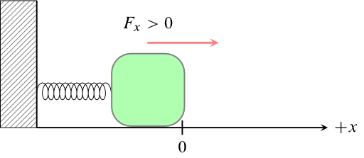
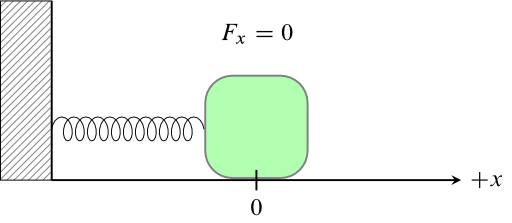
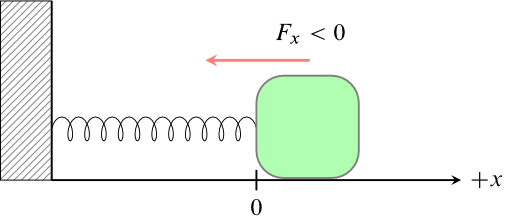

# Classical Harmonic Oscillator

## Compressed Harmonic Oscillator
[More Detail](harmonic-oscillator-compressed/Readme.md) | [LaTeX Source](harmonic-oscillator-compressed/harmonic-oscillator-compressed.tex)

## Harmonic Oscillator at Equilibrium Position
[More Detail](harmonic-oscillator-equilibrium/Readme.md) | [LaTeX Source](harmonic-oscillator-equilibrium/harmonic-oscillator-equilibrium.tex)

## Stretched Harmonic Oscillator
[More Detail](harmonic-oscillator-stretched/Readme.md) | [LaTeX Source](harmonic-oscillator-stretched/harmonic-oscillator-stretched.tex)

# License

[![Creative Commons License][image-1]][1]  
Except where otherwise noted, "Images for Physical Chemistry" by Dale J. Brugh is licensed under a [Creative Commons Attribution-ShareAlike 4.0 International License][1]. 

If you use any portion of this work, please attribute the author (as required by the license) and provide a link to [https://github.com/djbrugh/pchem-images](https://github.com/djbrugh/pchem-images). 

[1]:    http://creativecommons.org/licenses/by-sa/4.0/

[image-1]:  https://i.creativecommons.org/l/by-sa/4.0/88x31.png